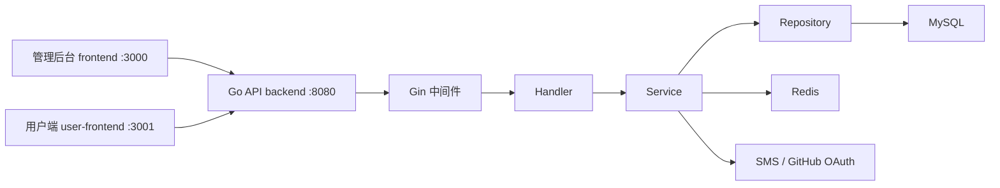
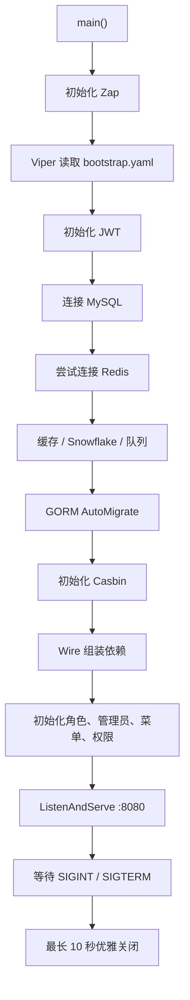

# KeystoneGo 项目学习指南（Go 初学者版）

> 这份文档的目标不是让你一次看懂全部代码，而是帮助你建立一张“项目地图”：程序从哪里启动、一次请求经过哪些层、每个包负责什么，以及应该按什么顺序学习。

配套的按功能速查笔记：[FEATURE_IMPLEMENTATION_REFERENCE.md](FEATURE_IMPLEMENTATION_REFERENCE.md)。遇到登录、日志、权限、配置、缓存等具体功能时，可以直接在速查笔记中查前后端调用链。

## 1. 先用一句话认识项目

KeystoneGo 是一个前后端分离的通用网站底座：

- `backend`：Go 编写的 HTTP API 服务。
- `frontend`：Vue 编写的管理后台。
- `user-frontend`：Vue 编写的普通用户端。
- MySQL：保存用户、角色、菜单和权限数据。
- Redis：保存 Token 黑名单、缓存和队列数据；Redis 不可用时部分功能会降级。

三个目录不是三个后端。真正处理数据和权限的服务端只有 `backend`，两个 Vue 项目只是面向不同用户的页面。



## 2. 项目当前处于什么阶段

这个项目已经具备一个中型 Go Web 项目的基本形状：

- Gin 路由和中间件。
- GORM 数据库操作。
- Handler、Service、Repository 分层。
- JWT Access Token + Refresh Token。
- Casbin RBAC 权限控制。
- Wire 编译期依赖注入。
- Viper YAML 配置加载和监听。
- Zap 日志、TraceID、Prometheus 指标和限流。

但它仍然是学习/脚手架性质的项目，不是可以直接上线的成品：

- 当前没有任何 `*_test.go` 测试文件。
- 一些高级包已经编写和初始化，但没有进入业务调用链。
- 认证、权限、配置热更新和前后端字段中存在尚未闭环的地方。
- 配置目录中不应该长期保存真实密钥。

学习时应区分“代码已经存在”和“功能已经完整接入”。

## 3. 目录地图

```text
KeystoneGo/
├── backend/
│   ├── cmd/
│   │   ├── server/             # 后端服务启动入口
│   │   └── cli/                # CRUD 代码生成命令
│   ├── config/                 # YAML 配置、Casbin 模型
│   ├── internal/
│   │   ├── handler/            # 接收 HTTP 请求、返回响应
│   │   ├── service/            # 业务规则和流程编排
│   │   ├── repository/         # 数据库访问
│   │   ├── model/              # GORM 数据实体
│   │   └── middleware/         # Gin 中间件
│   ├── pkg/                    # 可复用的基础能力
│   ├── uploads/                # 上传文件保存位置
│   ├── go.mod
│   └── go.sum
├── frontend/                   # 管理后台
├── user-frontend/              # 普通用户端
└── PROJECT_LEARNING_GUIDE.md   # 本文档
```

### `internal` 为什么特殊

Go 对 `internal` 目录有语言级限制：目录外部的其他项目不能随意导入其中的包。它适合保存本项目自己的业务代码。

### `pkg` 是什么

`pkg` 中通常保存相对独立、可以被多个业务模块复用的能力，例如配置、数据库、Token、缓存和队列。

## 4. 正确安装依赖和启动项目

### 4.1 准备 MySQL

你本机 MySQL 的 `root` 用户没有密码，所以 `backend/config/bootstrap.yaml` 中的 DSN 应使用空密码形式：

```yaml
database:
  master_dsn: "root:@tcp(127.0.0.1:3306)/keystone?charset=utf8mb4&parseTime=True&loc=Local"
```

DSN 可以拆成：

```text
root          MySQL 用户名
:             后面原本是密码，现在为空
@tcp          使用 TCP 协议
127.0.0.1     MySQL 地址
3306          MySQL 端口
keystone      数据库名
parseTime     将 MySQL 时间转换为 Go time.Time
```

创建数据库：

```bash
mysql -u root
```

```sql
CREATE DATABASE IF NOT EXISTS keystone
CHARACTER SET utf8mb4
COLLATE utf8mb4_unicode_ci;

EXIT;
```

GORM 的 `AutoMigrate` 会创建表，但不会替你创建 `keystone` 数据库。

### 4.2 安装 Go 依赖

```bash
cd /Users/wangchunzheng/study/KeystoneGo/backend
go mod download
```

- `go mod download`：下载 `go.mod` 中声明的依赖。
- `go mod tidy`：根据源码的 `import` 添加缺少的依赖、删除不用的依赖，不是每次启动都要执行。
- `go run`、`go build` 和 `go test` 在缺少模块时通常也会自动下载。

### 4.3 启动 Go 后端

普通启动：

```bash
cd /Users/wangchunzheng/study/KeystoneGo/backend
go run ./cmd/server
```

为什么是 `./cmd/server`：

- `cmd/server/main.go` 中有 `func main()`。
- 正常构建还需要同时编译 `cmd/server/wire_gen.go`。
- `go run ./cmd/server` 会编译整个目录。
- 不要使用 `go run cmd/server/main.go`，它只编译单个文件，可能找不到 `InitComponents()`。

验证后端：

```bash
curl http://localhost:8080/healthz
curl http://localhost:8080/readyz
```

- `/healthz` 成功：Gin 服务已经运行。
- `/readyz` 成功：后端可以访问 MySQL。

### 4.4 Go 代码热重载

`go run ./cmd/server` 不会监听 `.go` 文件。修改 Go 代码以后需要按 `Ctrl+C`，再重新执行启动命令。

Viper 监听的是 YAML 配置，不是 Go 源代码。

如果想修改 Go 文件后自动编译、重启，可以使用 Air：

```bash
go install github.com/air-verse/air@latest
```

```bash
cd /Users/wangchunzheng/study/KeystoneGo/backend

air \
  --build.cmd "go build -o ./tmp/keystone-server ./cmd/server" \
  --build.entrypoint "./tmp/keystone-server"
```

开发时：

- 修改 `.go`：Air 重新编译和重启。
- 修改 `bootstrap.yaml`：运行中的 Viper 检测配置变化。

### 4.5 安装并启动两个前端

项目有 `package-lock.json`，优先使用 `npm ci`，避免意外改动锁文件。

管理后台：

```bash
cd /Users/wangchunzheng/study/KeystoneGo/frontend
npm ci
npm run dev
```

访问 <http://localhost:3000>。

普通用户端：

```bash
cd /Users/wangchunzheng/study/KeystoneGo/user-frontend
npm ci
npm run dev
```

访问 <http://localhost:3001>。

后端、管理后台和用户端是三个长期运行的进程，所以开发时通常需要三个终端。

## 5. 后端从哪里启动

入口文件是 `backend/cmd/server/main.go`。

启动顺序可以简化为：



第一次阅读 `main.go` 时，不需要进入每个函数。先理解“先配置，再基础设施，再业务组件，最后启动 HTTP 服务”的顺序。

## 6. 一次 HTTP 请求经过什么地方

以“查询用户列表”为例：

```text
浏览器 GET /api/v1/users
    ↓
Gin 全局中间件
    ↓
JWTAuth：验证 Token + Casbin 权限
    ↓
UserHandler.List
    ↓
UserService.List
    ↓
UserRepository.ListWithKeyword
    ↓
GORM 生成 SQL 并查询 MySQL
    ↓
response.Success 返回统一 JSON
```

对应代码阅读顺序：

1. `backend/cmd/server/wire.go`：找到路由 `/api/v1/users`。
2. `backend/internal/middleware/jwt.go`：看登录和权限检查。
3. `backend/internal/handler/user.go`：看参数如何从 HTTP 请求进入 Go。
4. `backend/internal/service/user.go`：看分页默认值和业务规则。
5. `backend/internal/repository/user.go`：看 GORM 查询。
6. `backend/internal/model/user.go`：看 User 对应的表字段。
7. `backend/pkg/response/response.go`：看返回 JSON 的统一格式。

这条链路是整个项目最值得反复阅读的部分。

## 7. 四层业务结构

### 7.1 Model：数据长什么样

目录：`backend/internal/model`

例如：

```go
type User struct {
    BaseModel
    Username string
    Password string
    Roles    []Role
}
```

Model 主要表达：

- Go 字段类型。
- JSON 字段名称。
- GORM 数据库约束。
- 实体之间的关联。

你可以在这里学习结构体、结构体嵌入、struct tag、切片、多对多关系和 `time.Time`。

### 7.2 Repository：怎样访问数据库

目录：`backend/internal/repository`

Repository 负责数据库查询，不应该处理 HTTP 请求。

```go
func (r *UserRepository) FindByUsername(username string) (*model.User, error) {
    var user model.User
    err := r.db.Where("username = ?", username).First(&user).Error
    return &user, err
}
```

这里可以学习指针接收者、构造函数、错误返回、GORM 查询和泛型 `BaseRepository[T]`。

### 7.3 Service：业务规则是什么

目录：`backend/internal/service`

Service 连接多个 Repository 或基础设施，处理真正的业务规则。例如登录需要：

1. 查询用户。
2. 判断账户状态。
3. 验证密码。
4. 查询角色。
5. 生成 Token。

这些步骤不应该全部塞进 Handler。

### 7.4 Handler：HTTP 世界和 Go 世界的边界

目录：`backend/internal/handler`

Handler 负责：

- 读取 Path、Query、Header 和 JSON。
- 调用 Service。
- 把结果转换成 HTTP JSON。

Handler 不应该自己写复杂 SQL，也不应该承载大量业务规则。

## 8. Wire 依赖注入怎么理解

Service 需要 Repository，Handler 又需要 Service。如果全部手动创建，会出现大量代码：

```go
userRepo := repository.NewUserRepository(db)
roleRepo := repository.NewRoleRepository(db)
userSvc := service.NewUserService(userRepo, roleRepo)
userHandler := handler.NewUserHandler(userSvc)
```

项目用 Google Wire 根据构造函数依赖关系生成这些代码。

- `cmd/server/wire.go`：告诉 Wire 有哪些 Provider。
- `cmd/server/wire_gen.go`：Wire 生成的最终 Go 代码，正常运行时真正参与编译。
- `InitComponents(db)`：返回组装完成的 `*gin.Engine`。

需要修改依赖关系时改 `wire.go`，然后重新生成：

```bash
cd /Users/wangchunzheng/study/KeystoneGo/backend
go generate ./cmd/server
```

不要手动维护 `wire_gen.go`。

## 9. Viper 配置系统

### 9.1 配置结构体

`backend/pkg/config/config.go` 中的 `AppConfig` 是所有配置的入口：

```go
type AppConfig struct {
    App      AppCfg      `mapstructure:"app"`
    JWT      JWTCfg      `mapstructure:"jwt"`
    Database DatabaseCfg `mapstructure:"database"`
    Redis    RedisCfg    `mapstructure:"redis"`
}
```

`mapstructure:"database"` 表示 YAML 的 `database` 节点写入 `Database` 字段。

### 9.2 哪些 YAML 会自动生成

| 文件 | 来源 | 当前用途 |
|---|---|---|
| `bootstrap.yaml` | 人工提供 | Viper 的主配置输入 |
| `backup_cache.yaml` | 程序生成/覆盖 | 主配置读取失败时的备份 |
| `permissions.yaml` | 人工文件 | 当前没有代码读取 |

`InitConfig()` 的流程：

```text
ReadInConfig
    ↓
Unmarshal + DecryptHook
    ↓
GlobalManager.Update
    ↓
WriteConfigAs backup_cache.yaml
    ↓
WatchConfig
```

### 9.3 `RWMutex` 在保护什么

`ConfigManager` 用 `sync.RWMutex` 保护当前配置指针：

- `RLock`：多个 goroutine 可以同时读取。
- `Lock`：更新配置时独占。
- `defer`：函数返回前自动释放锁。

当前设计采用“创建一份完整新配置，然后整体替换指针”，而不是在旧配置对象上逐字段修改。

### 9.4 热更新的真实范围

Viper 能发现 YAML 变化，并把新值写进 `GlobalManager`，但不代表所有组件都会自动重新初始化。

当前实际情况：

- `enable_register`：Handler 每次请求都会读取，可以动态生效。
- `maintenance_mode`：有字段、有日志，但没有中间件真正拦截请求。
- 端口：HTTP Server 启动时读取一次，修改后不会自动换端口。
- 数据库和 Redis：启动时创建连接，修改 DSN 不会自动重连。
- JWT Secret：Token 包初始化时注入，修改配置不会自动替换。
- `jwt.expire`：当前 Token 代码使用固定常量，没有使用这个配置值。

所以应理解为“配置对象热加载”，而不是“所有业务能力都支持动态重配置”。

## 10. Gin 路由和中间件

路由定义在 `backend/cmd/server/wire.go`，正常构建实际使用生成后的 `wire_gen.go`。

全局中间件顺序：

```text
Recovery
→ Trace
→ Cors
→ Logger
→ Metrics
→ RateLimit
→ 路由匹配
→ JWTAuth（仅 /api/v1 认证组）
→ Handler
```

顺序很重要：

- Recovery 应尽量靠前，捕获后续 panic。
- Trace 在 Logger 前面，日志才能获得 TraceID。
- JWTAuth 在受保护路由组上，登录和注册接口才不需要 Token。

公开接口包括健康检查、登录、注册、Token 刷新、SMS 和 GitHub OAuth。用户、角色、菜单、权限和监控接口需要 JWT。

## 11. JWT 和登录流程

核心文件：

- `backend/pkg/token/token.go`
- `backend/internal/service/auth.go`
- `backend/internal/handler/auth.go`
- `backend/internal/middleware/jwt.go`

### 11.1 密码登录

```text
username + password
    ↓
根据 username 查询用户
    ↓
bcrypt 比对密码
    ↓
查询用户角色
    ↓
生成 Access Token + Refresh Token
```

密码数据库中保存的是 bcrypt 哈希，不是原密码。

### 11.2 两种 Token

- Access Token：15 分钟，访问普通 API。
- Refresh Token：7 天，用来换取新 Token。

Claims 里包含 UserID、Username、Roles、TokenType 和 JTI。

### 11.3 登出

登出时后端把 Access Token 的 JTI 写入 Redis 黑名单。以后 JWT 中间件即使验证签名成功，也会因为黑名单拒绝该 Token。

Redis 不可用时，项目选择降级运行，此时黑名单能力不可用。

## 12. Casbin RBAC 权限

Casbin 中三个核心参数：

```text
sub：谁，例如用户 ID 或角色 code
obj：访问什么，例如 /api/v1/users
act：怎样访问，例如 GET
```

策略例子：

```text
p, admin, /api/v1/users, GET
```

表示 `admin` 可以使用 `GET` 访问用户列表。

用户和角色的关系是：

```text
g, 1, admin
```

表示用户 `1` 拥有 `admin` 角色。

`JWTAuth` 当前会先解析 JWT，然后使用用户 ID、请求路径和 HTTP 方法执行 Casbin `Enforce`。

## 13. GORM 和数据库模型

主要表：

| Go Model | MySQL 表 | 作用 |
|---|---|---|
| `User` | `sys_user` | 用户 |
| `Role` | `sys_role` | 角色 |
| `Menu` | `sys_menu` | 前端菜单/按钮资源 |
| `Permission` | `sys_permission` | API 权限定义 |
| `UserRole` | `user_roles` | 用户和角色多对多 |
| `RoleMenu` | `role_menus` | 角色和菜单多对多 |
| `UserAuth` | `user_auths` | 密码、手机、GitHub 等登录渠道 |
| `CasbinRule` | `casbin_rule` | Casbin 策略 |
| `OperationLog` | `sys_operation_log` | 操作日志实体 |

`BaseModel` 通过结构体嵌入复用：

```go
type BaseModel struct {
    ID        uint64
    CreatedAt time.Time
    UpdatedAt time.Time
}
```

启动时 `runMigrations()` 调用 `AutoMigrate` 创建或补充表结构。

## 14. 两个 Vue 前端分别做什么

### 管理后台 `frontend`

包含登录、用户管理、角色管理、菜单管理、权限管理和系统监控。

Axios 的 `baseURL` 是 `/api/v1`，Vite 开发服务器把 `/api` 代理到 `http://localhost:8080`。

### 普通用户端 `user-frontend`

包含注册、密码登录、短信登录、GitHub OAuth 回调、找回密码、个人资料和登录渠道绑定。

两个前端分别使用不同的 localStorage key，避免同时打开时 Token 相互覆盖。

## 15. 高级基础设施包的真实接入状态

不要因为看到很多包就一次全部学习。先确认它们是否真的被业务调用。

| 包 | 代码能力 | 当前实际接入状态 |
|---|---|---|
| `pkg/cache` | BigCache + Redis + Singleflight | 启动时初始化，但 Service/Repository 没有调用缓存读写 |
| `pkg/queue` | Redis Stream、重试、DLQ、延时任务 | 启动了调度和指标，没有业务生产者/消费者 |
| `pkg/idgen` | Snowflake ID | 启动时初始化，但业务没有调用 `NextID()` |
| `pkg/circuitbreaker` | 熔断和降级 | 当前没有调用方 |
| `internal/*/coupon.go` | CLI 生成的 CRUD 示例 | 没有接入 Wire、路由和迁移 |
| `pkg/sms` | 验证码发送和验证 | 开发模式固定验证码，不是生产短信服务 |

这些适合在你掌握主链路后再学习。

## 16. 学习时必须知道的项目问题

下面不是要求你立刻全部修复，而是提醒你不要把现有代码的所有行为都当成最佳实践。

### 高优先级

1. `bootstrap.yaml` 和备份配置中不应该提交真实 JWT、数据库或 OAuth 密钥。
2. 程序会创建固定密码管理员，真实部署必须改为一次性密码或初始化流程。
3. 普通用户名注册只创建用户，没有立即分配 `user` 角色；可能登录成功但受保护接口全部 403。
4. 用户角色替换时调用了删除直接权限的方法，不是删除旧角色关系，Casbin 可能残留旧角色。
5. 删除角色时使用数字 ID 清理 Casbin，但策略主体实际是角色 code，可能清理不完整。
6. GitHub OAuth 使用固定 `state`，回调没有验证，不能有效防止 OAuth CSRF。

### 中优先级

1. `maintenance_mode` 没有真正阻止请求。
2. `jwt.expire` 和 `log.level` 配置当前没有进入对应运行逻辑。
3. 菜单后端返回 `visible`，管理前端接口类型却期望 `hidden` 和 `status`。
4. 用户没有菜单时，Service 会返回全部菜单；这不是合适的权限兜底。
5. IP 限流器的 Map 没有过期清理，长期运行可能积累大量 IP。
6. 头像上传缺少文件大小、MIME 类型和扩展名白名单。
7. 多处 Handler 忽略 ID 解析和 JSON 绑定错误。
8. 业务错误大多返回 HTTP 200，会影响 HTTP 监控和客户端语义。

### 工程质量

1. 当前没有测试。
2. 部分 Go 文件没有经过 `gofmt`。
3. 根目录缺少正式 README、部署文件和环境变量示例。
4. 部分注释比实现更理想化，应以调用关系和测试结果为准。

## 17. Go 知识点与项目文件对照

| Go 知识 | 推荐文件 |
|---|---|
| 包、导入、函数 | `cmd/server/main.go` |
| 结构体和 struct tag | `pkg/config/config.go`、`internal/model/user.go` |
| 指针 | `pkg/config/config.go`、Repository 构造函数 |
| 方法和接收者 | `internal/repository/user.go` |
| 接口 | `pkg/utils/menu_tree.go` |
| 泛型 | `internal/repository/base.go` |
| 错误处理 | `internal/service/auth.go` |
| `defer` | 配置锁、HTTP Body Close、优雅关闭 |
| `context.Context` | 数据库、Redis、优雅关闭 |
| goroutine | `cmd/server/main.go`、`pkg/queue` |
| channel | `main.go` 等待系统信号 |
| `sync.Mutex` | SMS、Snowflake、限流器 |
| `sync.RWMutex` | 配置管理器 |
| JSON 编解码 | Handler、OAuth、Queue |
| HTTP 服务 | Gin Handler、`http.Server` |
| 构建标签 | `wire.go` 和 `wire_gen.go` |

## 18. 推荐学习路线

### 第一阶段：跑通项目

1. 创建数据库。
2. 启动后端。
3. 请求 `/healthz` 和 `/readyz`。
4. 启动管理前端。
5. 使用开发管理员登录。
6. 启动用户前端并注册用户。

不要一开始修改缓存、队列和 OAuth。

### 第二阶段：理解一个只读请求

选择 `GET /api/v1/users`：

1. 找路由。
2. 找中间件。
3. 找 Handler。
4. 找 Service。
5. 找 Repository。
6. 找 Model。
7. 在每层增加一条临时日志，观察执行顺序。

### 第三阶段：理解一个写请求

选择创建菜单或创建角色：

1. 前端发送什么 JSON。
2. Handler 绑定到什么结构体。
3. Service 修改了哪些默认字段。
4. Repository 生成什么 SQL。
5. 数据库新增了什么记录。

### 第四阶段：学习登录和权限

1. bcrypt 如何验证密码。
2. JWT Claims 有哪些字段。
3. Access Token 和 Refresh Token 的区别。
4. JWT 中间件怎样向 Gin Context 写入用户 ID。
5. Casbin 的 `p` 和 `g` 策略分别是什么。
6. 修复注册用户没有立即分配角色的问题。

### 第五阶段：补测试

建议从不需要数据库的单元测试开始：

1. `utils.HashPassword` / `CheckPasswordHash`。
2. `utils.MenuTypeString`。
3. `utils.BuildMenuTree`。
4. `idgen.NewSnowflake`。
5. `config.ConfigManager` 并发读写。

然后再学习使用测试数据库或 Mock Repository 测试 Service。

### 第六阶段：再看高级能力

按下面顺序学习：Redis Token 黑名单、多级缓存、Singleflight、Redis Stream、延时队列、Prometheus、熔断器。

## 19. 适合初学者的练习任务

### 练习 1：增加版本接口

新增 `GET /version`，返回项目名称和版本。只修改路由，适合熟悉 Gin。

### 练习 2：让维护模式真正生效

写一个全局中间件：

1. 每次请求读取 `GlobalManager.Get()`。
2. 如果 `MaintenanceMode == true`，返回维护响应。
3. 放行 `/healthz`。
4. 修改 YAML，验证无需重启即可生效。

这会同时练习 Viper、RWMutex 和 Gin 中间件。

### 练习 3：修复注册用户角色

注册成功后查询 `user` 角色、写入 `user_roles`、写入 Casbin `g` 规则，并为流程添加测试。

### 练习 4：统一菜单字段

选择一种接口契约：后端返回 `hidden` 和 `status`，或者前端改用 `visible`。不要让两端分别猜测字段含义。

### 练习 5：给头像上传增加限制

限制最大 2 MB，只允许 JPEG、PNG、WebP，不直接信任用户文件名和扩展名。

## 20. 常见启动错误

### 找不到配置或备份不可用

通常是运行目录不对。应在 `backend` 目录启动：

```bash
cd /Users/wangchunzheng/study/KeystoneGo/backend
go run ./cmd/server
```

### `Unknown database 'keystone'`

先手动创建 `keystone` 数据库。

### `Access denied for user 'root'`

检查 `bootstrap.yaml` 的 DSN。无密码应为 `root:@tcp(...)`。

### `vue-tsc: command not found`

进入对应前端目录执行 `npm ci`。

### 修改 Go 文件后没有变化

`go run` 不会监听代码。手动重启，或者使用 Air。

### 修改 YAML 后日志显示重载，但数据库没有改变

Viper 只替换配置对象，现有数据库连接没有重新创建。这是当前实现范围，不是 Viper 读取失败。

### 登录成功但接口返回 403

检查：

1. 用户是否拥有角色。
2. `user_roles` 是否有记录。
3. `casbin_rule` 是否有用户到角色的 `g` 规则。
4. 角色是否拥有对应路径和方法的 `p` 规则。

## 21. 常用命令速查

```bash
# 下载 Go 依赖
cd backend
go mod download

# 整理 Go 依赖
go mod tidy

# 编译检查所有 Go 包
go test ./...

# 静态检查
go vet ./...

# 格式化单个 Go 文件
gofmt -w path/to/file.go

# 普通启动后端
go run ./cmd/server

# 构建后端二进制
go build -o ./bin/keystone-server ./cmd/server

# 重新生成 Wire
go generate ./cmd/server

# 前端安装依赖和启动
npm ci
npm run dev

# 前端构建
npm run build
```

## 22. 推荐文件阅读顺序

不要按照目录字母顺序读，按调用链读：

1. `backend/cmd/server/main.go`
2. `backend/pkg/config/config.go`
3. `backend/pkg/config/loader.go`
4. `backend/cmd/server/wire.go`
5. `backend/cmd/server/wire_gen.go`
6. `backend/internal/model/user.go`
7. `backend/internal/repository/base.go`
8. `backend/internal/repository/user.go`
9. `backend/internal/service/user.go`
10. `backend/internal/handler/user.go`
11. `backend/pkg/response/response.go`
12. `backend/internal/service/auth.go`
13. `backend/pkg/token/token.go`
14. `backend/internal/middleware/jwt.go`
15. `backend/pkg/casbin/casbin.go`
16. `backend/config/rbac_model.conf`
17. 其他中间件
18. 缓存、队列、Snowflake 和熔断器

## 23. 阅读代码时使用的四个问题

打开任何函数时，先回答：

1. 输入从哪里来？
2. 输出交给谁？
3. 它修改了什么状态？
4. 失败时错误交给谁处理？

例如 `AuthService.Login`：

- 输入：Handler 传入的用户名和密码。
- 输出：TokenPair、User、error。
- 状态：通常只读取数据库，不修改用户。
- 错误：返回 Handler，由 Handler 转为统一 JSON。

能稳定回答这四个问题，就已经开始真正理解项目，而不是只认识语法。

## 24. 最终学习目标

你不需要背下所有包。完成下面几件事，就说明已经掌握了这个项目的核心：

1. 能从路由找到 Handler、Service、Repository 和 Model。
2. 能自己新增一个简单 CRUD 模块并接入 Wire。
3. 能解释 JWT 认证和 Casbin 鉴权的区别。
4. 能解释 Viper 配置热加载与 Go 代码热重载的区别。
5. 能写基本单元测试，而不是只通过浏览器验证。
6. 能发现注释和实际调用链不一致的地方。

学习顺序比学习速度更重要：先跑通，后理解；先主链路，后基础设施；先写测试，后做复杂优化。
